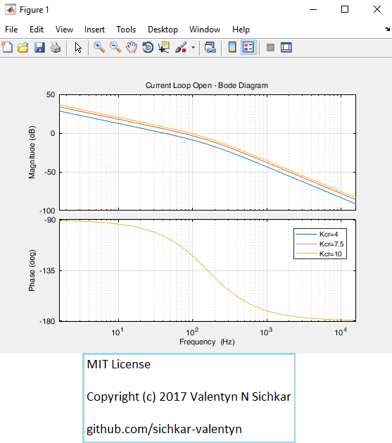
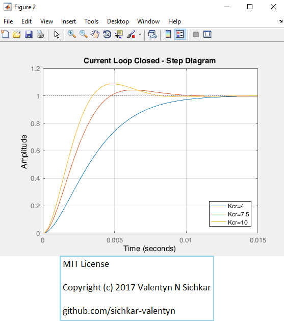
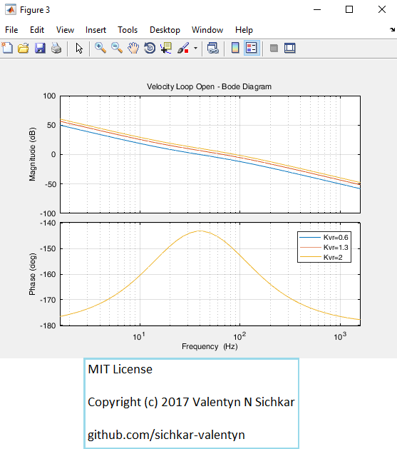
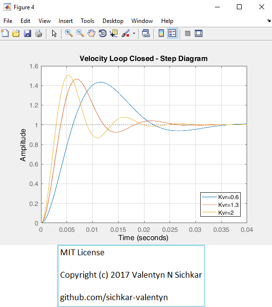

# Dynamic Analysis of Current and Velocity Loops
Simulation of a DC motors feedback loop via current and velocity regulation

### Reference to:
[1] Valentyn N Sichkar. Simulation of a DC motors feedback loop via current and velocity regulation // GitHub platform [Electronic resource]. URL: https://github.com/sichkar-valentyn/Dynamic_Analysis_of_Current_and_Velocity_Loops (date of access: XX.XX.XXXX)

## Description
Simulation of a DC motor’s feedback loop via current and velocity regulation using "Control System Toolbox" in Matlab.

 _Current Loop_
 Utilizing the Bode and Step diagrams for varying Kcr, it can be shown that the optimal value for Kcr is 7.5. This Kcr value produces the idea overshoot of 4.3%, has a settling time of 0.0063 seconds, and has a phase margin of 65.5 deg.

 _Velocity Loop_
 Utilizing the Bode and Step diagrams for varying Kvr, it can be shown that the optimal value for Kvr is 0.6. This Kcr value produces the idea overshoot of 43.4%, has a settling time of 0.0331 seconds, and has a phase margin of 36.9 deg.

## Current Loop Open - BodeDiagram

## Current Loop Closed - Step Diagram

## Velocity Loop Open - Bode Diagram

## Velocity Loop Closed - Step Diagram

## MIT License
## Copyright (c) 2017 Valentyn N Sichkar
## github.com/sichkar-valentyn
### Reference to:
[1] Valentyn N Sichkar. Simulation of a DC motors feedback loop via current and velocity regulation // GitHub platform [Electronic resource]. URL: https://github.com/sichkar-valentyn/Dynamic_Analysis_of_Current_and_Velocity_Loops (date of access: XX.XX.XXXX)
